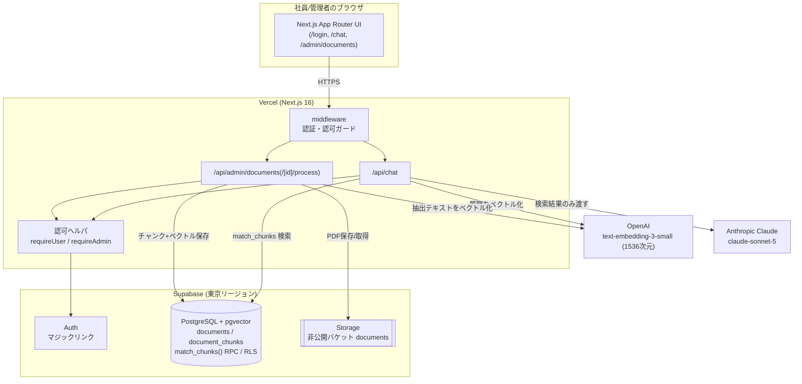
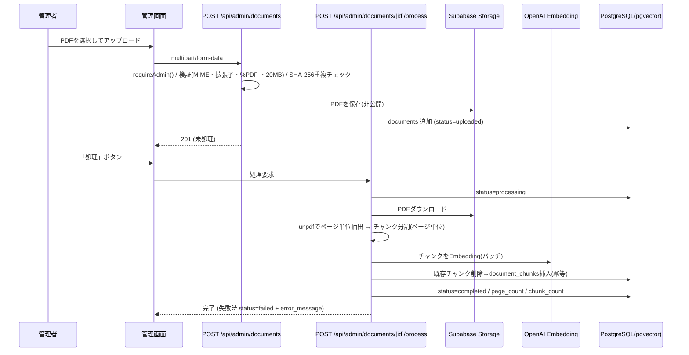
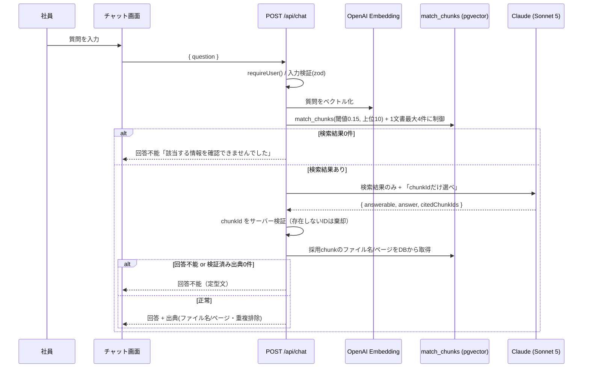
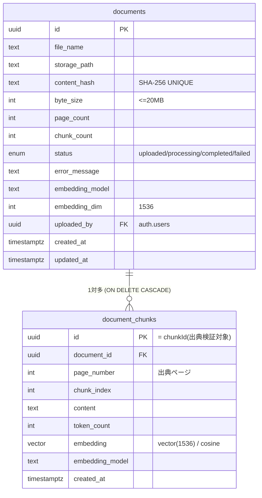
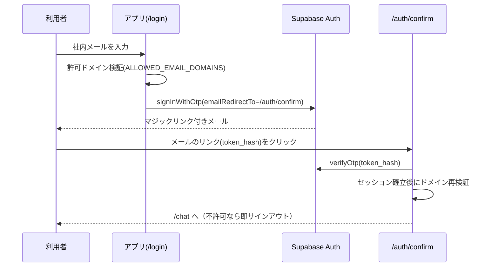
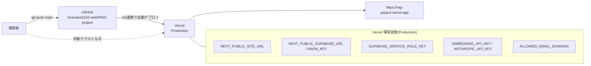

# アーキテクチャ図（情報システム部門向け）

社内文書検索AI（RAG）の構成・データフロー・データモデルを Mermaid で示す。
本書は実装（`src/`・`supabase/migrations/`）に基づく。

- 本番URL: https://rag-prpject.vercel.app
- 主要コンポーネント: Next.js(Vercel) / Supabase(東京: Auth・PostgreSQL+pgvector・Storage) / OpenAI Embedding / Claude API

---

## 1. システム全体構成

---

## 2. 文書取り込みフロー（管理者）

---

## 3. 質問応答フロー（RAG）

> ポイント: 出典は AI の出力を信用せず、**サーバー側で DB から復元**する。検索結果は「データ」として扱い、PDF本文中の指示には従わない（プロンプトインジェクション対策）。

---

## 4. データモデル（ER図）

- 検索は SQL 関数 `match_chunks(query_embedding, match_threshold, match_count)`（cosine類似度、`ivfflat` インデックス）。
- RLS 有効。閲覧は認証済み全員、登録/更新/削除は管理者（`is_admin()` = JWT の `app_metadata.role='admin'`）のみ。Storage は非公開・管理者ポリシー。

---

## 5. 認証フロー（マジックリンク）

---

## 6. デプロイ / CI-CD

> 補足: PDF処理 `/api/admin/documents/[id]/process` は `maxDuration=300`、チャット `/api/chat` は `maxDuration=60`。長時間処理の安定運用には Vercel Pro を推奨。
